# 基于深度学习的心电数据分类

## 1 引言

### 1.1 临床背景

心血管疾病是全球首要死因，心电图（ECG）作为最常用的无创心脏检查手段，在心律失常筛查和心血管疾病诊断中起着核心作用。传统 ECG 解读依赖心脏病学专家的人工判读，这一过程既耗时又受主观经验影响，难以满足大规模筛查和实时监护的需求。因此，开发自动化、高准确率的 ECG 分类算法具有重要的临床价值。

MIT-BIH 心律失常数据库是 ECG 自动分类研究中使用最广泛的基准数据集之一。本实验使用的 Heartbeat Dataset 将 ECG 信号裁剪、重采样至固定长度 188，标注为 5 类心跳：正常搏动（N）、室上性异位搏动（S）、室性异位搏动（V）、融合搏动（F）和未知搏动（Q）。其中正常心跳（N 类）占比约 83%，而 S、V、F 类合计不足 15%，严重的类别不平衡是分类任务的核心挑战。

### 1.2 研究目标

本作业围绕以下目标展开：

1. 构建基于 1D-ResNet 的深度学习基线，与经典机器学习方法进行统计对比
2. 系统性地探究模型设计中的关键选择：输入模态、网络架构、分类策略、数据增强和鲁棒性
3. 引入注意力机制和 SOTA 模型进一步提升性能，并通过可解释性工具揭示模型的决策依据

## 2 方法

### 2.1 数据集与预处理

使用 MIT-BIH 心律失常数据集，训练集 87,553 条，测试集 21,892 条。每条样本为 125Hz 采样率下的 187 维时间序列（第 188 维为标签），5 类分布严重不均衡。

数据划分采用严格方案：训练集按 9:1 分层抽样为训练/验证集，测试集仅在最终评估时使用，训练过程完全不可见。所有实验共享此划分。

### 2.2 统一训练配置

为公平比较，所有实验共享以下基线配置（仅被探究的变量改变）：

| 配置项 | 值 |
|--------|-----|
| 模型 | ResNet1D(kernel_size=7, use_se=False), ResNet-18 深度 |
| 损失函数 | FocalLoss(alpha=类别反比权重, gamma=2.0) |
| 优化器 | AdamW, lr=1e-3, weight_decay=1e-4 |
| 训练轮次 | epochs=100, early stopping(patience=15) |
| 学习率调度 | ReduceLROnPlateau |
| 统计方法 | N_TRIALS=5（种子 42-46） |

Focal Loss 通过降低易分类样本的损失权重（gamma=2.0）并引入类别反比权重（alpha），有效缓解了类别不平衡问题。

### 2.3 模型架构

**ResNet1D**：标准 ResNet-18 结构的 1D 版本。Stem 层使用 Conv1d(1→64, kernel=15, stride=2) + MaxPool，随后 4 个 stage 各含 2 个 BasicBlock（通道数 64→128→256→512），全局平均池化后接 Dropout(0.3) 和全连接层，约 8.7M 参数。

**BiLSTM**：双向 LSTM，hidden_size=256, num_layers=3，约 3.7M 参数。

**MLP-Mixer**：基于 Patch 的结构，将信号分割为非重叠 patch 后通过 MixerLayer（token-mixing + channel-mixing）交替处理，hidden_dim=256, 8 层，约 4.3M 参数。

**InceptionTime**：参考 Fawaz et al. (2019) 的官方架构，6 个 InceptionBlock 堆叠，每层 bottleneck + 并行多尺度卷积(K=3/5/7) + MaxPool + 残差连接，约 136K 参数。

## 3 实验结果与分析

### 3.1 Phase 1: DL/ML 基线对比

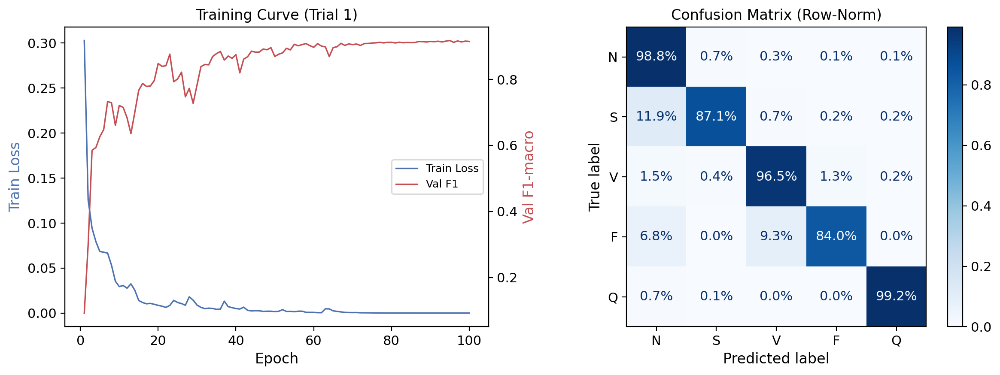

5 次独立试验的测试集 F1-macro：

| 方法 | F1-macro (mean±std) | 5 trials |
|------|---------------------|----------|
| RF + SMOTE (ML) | 0.9013 ± 0.0017 | 0.9007, 0.8996, 0.9013, 0.9045, 0.9006 |
| ResNet1D + FocalLoss (DL) | **0.9130 ± 0.0056** | 0.9140, 0.9119, 0.9220, 0.9043, 0.9129 |

配对 T 检验：t = 3.484, p = 0.0253（p < 0.05）

**分析**：深度学习方法在 F1-macro 上显著优于传统机器学习方法（提升约 1.2 个百分点），且统计检验确认差异显著。这主要得益于 ResNet1D 通过多层卷积自动提取时序特征的层次化表示能力，而 RF + SMOTE 虽能通过过采样缓解不平衡，但其基于原始特征的决策边界表达能力有限。

DL 方法的方差（0.0056）高于 ML（0.0017），这是深度学习随机初始化的自然结果，但 5 次试验的最低值（0.9043）仍高于 ML 的最高值（0.9045），表明 DL 的优势具有稳健性。

从混淆矩阵看，DL 在少数类上表现明显更好：S 类 F1 = 0.823，V 类 F1 = 0.957，F 类 F1 = 0.805。F 类（融合搏动，仅 162 个样本）是最难分类的类别，这与其在临床中形态介于正常和室性搏动之间的特点一致。

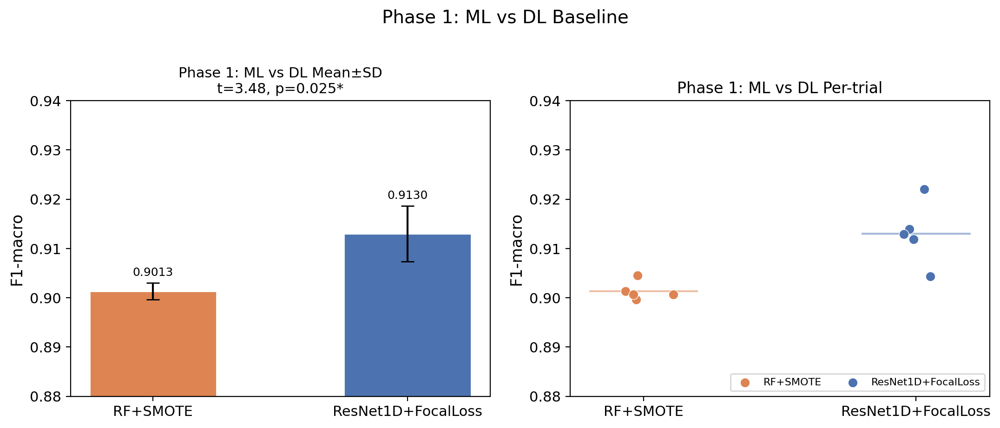

### 3.2 Phase 2: 感受野与超参数

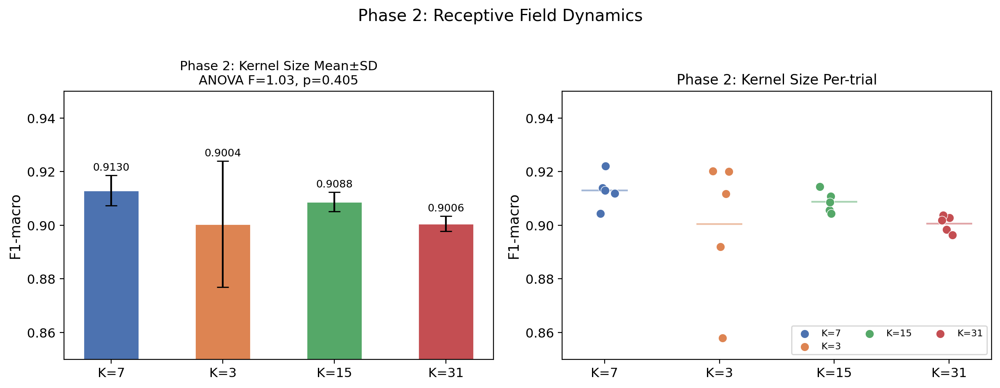

5 次独立试验的测试集 F1-macro：

| Kernel Size | F1-macro (mean±std) | 5 trials |
|-------------|---------------------|----------|
| K=7 (复用 Phase 1) | **0.9130 ± 0.0056** | 0.9140, 0.9119, 0.9220, 0.9043, 0.9129 |
| K=3 | 0.9004 ± 0.0235 | 0.8580, 0.9202, 0.8920, 0.9200, 0.9117 |
| K=15 | 0.9088 ± 0.0036 | 0.9108, 0.9056, 0.9086, 0.9145, 0.9044 |
| K=31 | 0.9006 ± 0.0028 | 0.8985, 0.9028, 0.8963, 0.9037, 0.9018 |

ANOVA: F = 1.03, p = 0.405（p > 0.05，组间无显著差异）

**分析**：四种卷积核大小的 F1-macro 差异未达到统计显著性（p = 0.405），表明在本数据集和训练配置下，感受野大小对分类性能的影响有限。

K=7 表现最优（0.9130），K=15 紧随其后（0.9088），两者差距仅 0.4 个百分点。K=3 和 K=31 的均值较低（~0.900），呈现出"中间优、两端弱"的趋势。这可从 ECG 信号的物理特性理解：K=3 的感受野过小，难以捕捉完整的 QRS 波群形态；K=31 虽感受野大，但引入了过多无关上下文，稀释了关键的局部波形特征。K=7 和 K=15 的感受野恰好覆盖了典型 QRS 波群的持续时间（约 60-120ms / 8-15 个采样点），因此在特征提取效率上具有优势。

值得注意的是，K=3 的方差远高于其他配置（0.0235 vs < 0.006），5 次试验中出现了 0.858 的极端低值。这表明小卷积核的模型训练不够稳定，可能因为过小的卷积核需要更深的网络层数才能积累足够的感受野，增加了优化难度。

#### 3.2.2 任务 2.2: 优化空间平滑性（LR × Weight Decay 网格搜索）

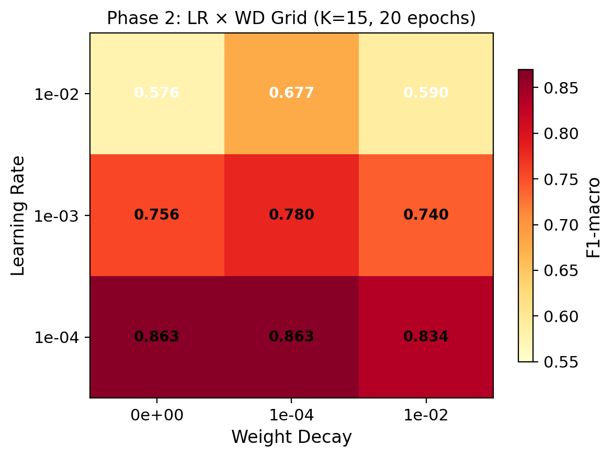

固定 K=15，在 3×3 网格（LR=[1e-2, 1e-3, 1e-4] × WD=[0, 1e-4, 1e-2]）上进行单次探索实验（20 epochs）：

| LR \ WD | 0 | 1e-4 | 1e-2 |
|---------|-------|------|-------|
| 1e-2 | 0.576 | 0.677 | 0.590 |
| 1e-3 | 0.756 | **0.780** | 0.740 |
| 1e-4 | **0.863** | **0.863** | 0.834 |

**分析**：热力图呈现清晰的梯度模式——学习率是主导因素。LR=1e-4 行整体最优（0.834~0.863），远高于 LR=1e-2 行（0.576~0.677）。这表明对于 ResNet-18 深度网络，过大的学习率（1e-2）导致训练振荡，损失函数难以收敛。

在最优 LR=1e-4 下，Weight Decay 的影响较小：WD=0 和 WD=1e-4 均达到 0.863（完全一致），仅 WD=1e-2 时略有下降（0.834），说明适度正则化无害但过强正则化会抑制特征学习。优化空间在 LR=1e-4 附近较为平坦，具有良好的鲁棒性。

值得注意的是，网格搜索仅训练 20 epochs，F1 最高为 0.863，低于 baseline 的 100 epochs 结果（0.909）。这说明 K=15 配置需要更长的训练周期才能充分收敛，也从侧面印证了学习率调度器（ReduceLROnPlateau）在长训练中的必要性。

### 3.3 Phase 3: 消融实验

#### 3.3.1 实验 3.1: 输入模态对比

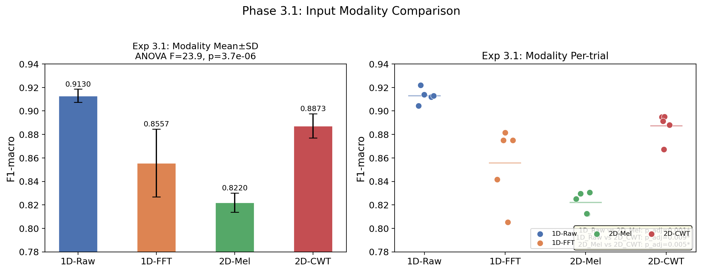

固定特征提取器（1D 用 ResNet1D，2D 用 ResNet2D），对比四种输入模态的 5 次独立试验结果：

| 模态 | 表示形式 | F1-macro (mean±std) | 5 trials |
|------|----------|---------------------|----------|
| **1D-Raw** | 原始时间序列 | **0.9130 ± 0.0056** | 0.9140, 0.9119, 0.9220, 0.9043, 0.9129 |
| 1D-FFT | 频域幅度谱 | 0.8557 ± 0.0289 | 0.8051, 0.8816, 0.8416, 0.8751, 0.8750 |
| 2D-Mel | Mel 频谱图 | 0.8220 ± 0.0081 | 0.8295, 0.8307, 0.8122, 0.8251, 0.8124 |
| 2D-CWT | 连续小波变换图 | 0.8873 ± 0.0103 | 0.8881, 0.8948, 0.8950, 0.8673, 0.8914 |

ANOVA: F = 23.92, p = 3.73e-6（p < 0.001）

事后检验（Bonferroni 校正）：

| 配对 | t 值 | p_adj | 显著 |
|------|------|-------|------|
| 1D-Raw vs 1D-FFT | 3.60 | 0.137 | |
| **1D-Raw vs 2D-Mel** | **15.15** | **6.63e-4** | * |
| **1D-Raw vs 2D-CWT** | **7.70** | **9.20e-3** | * |
| 1D-FFT vs 2D-Mel | 2.18 | 0.568 | |
| 1D-FFT vs 2D-CWT | -1.96 | 0.733 | |
| **2D-Mel vs 2D-CWT** | **-8.93** | **5.21e-3** | * |

**分析**：模态选择对分类性能有极显著影响（ANOVA p = 3.7e-6），四种模态形成了清晰的性能梯度：1D-Raw > 2D-CWT > 1D-FFT > 2D-Mel。

**原始时域信号（1D-Raw）表现最优**（F1 = 0.913），这是因为 ECG 信号的诊断信息主要蕴含在波形的时序形态中——P 波、QRS 复合波、T 波的形状、间隔和幅度直接对应不同的心脏电活动模式。ResNet1D 的卷积操作天然擅长捕捉这些局部波形特征。

**CWT 排名第二**（F1 = 0.887），接近 1D-Raw。CWT 通过多尺度小波分解同时保留了时间和频率信息，其时频表示能够捕获 ECG 信号的瞬态特征。作为 2D 输入，它实际上提供了比原始信号更丰富的多尺度视角，但 2D 卷积在处理这种高度结构化的时频图时可能不如 1D 卷积高效。

**FFT 表现中等**（F1 = 0.856）且方差最大（std = 0.029）。频域变换虽然能揭示信号的频率成分，但完全丢失了时间定位信息。对于 ECG 分类，QRS 波群的时间位置和形态至关重要，FFT 的相位不变性使其无法区分某些在频谱上相似但时序结构不同的心跳类型。高方差则表明 FFT 表示下的优化景观更为崎岖。

**Mel 频谱图表现最差**（F1 = 0.822）。Mel 滤波器组设计用于模拟人耳听觉感知，其对低频的过度压缩并不适合 ECG 信号的频率分布特征。ECG 的关键诊断频段（0.5-40Hz）在 Mel 刻度下可能被过度平滑，损失了区分不同心律失常所需的频率分辨率。

值得注意的是，1D-Raw 与 1D-FFT 的差异未达到统计显著性（p_adj = 0.137），提示在 1D 框架下，时域和频域信息的差距可能通过更精细的频域处理来缩小。而 2D-CWT 显著优于 2D-Mel（p_adj = 0.005），证实了小波变换在 ECG 时频分析中的优势。

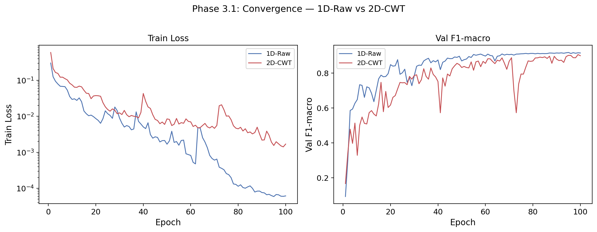

**收敛动力学**：对比 1D-Raw 和 2D-CWT 的训练曲线可以发现，1D-Raw 的损失下降更快（100 epochs 内 train_loss 从 0.30 降至 ~0.0001），而 2D-CWT 的初始损失更高（~0.55）且最终收敛至 ~0.001，收敛速度较慢。部分 2D-CWT 试验在训练末期 val_f1 仍有上升趋势（Δ = +0.016~+0.036），提示 2D-CWT 的性能差距可能部分源于训练不充分，更长的训练周期或更小的学习率可能进一步缩小与 1D-Raw 的差距。

#### 3.3.2 实验 3.2: 特征提取器的归纳偏置

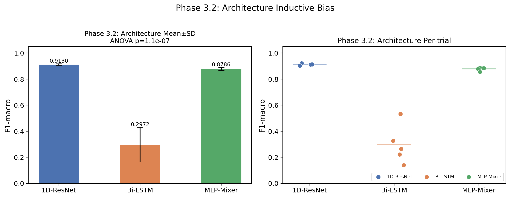

| 架构 | F1-macro (mean±std) | 参数量 | 推理延迟 |
|------|---------------------|--------|----------|
| **1D-ResNet** | **0.9130 ± 0.0056** | 8.73M | 1.68ms |
| MLP-Mixer | 0.8786 ± 0.0119 | 4.33M | 2.33ms |
| Bi-LSTM | 0.2972 ± 0.1328 | 3.69M | 9.08ms |

ANOVA: F = 80.66, p = 1.10e-7（p < 0.001）

事后检验（Bonferroni 校正）：

| 配对 | t 值 | p_adj | 显著 |
|------|------|-------|------|
| ResNet vs Bi-LSTM | 9.21 | 0.0023 | * |
| ResNet vs MLP-Mixer | 8.70 | 0.0029 | * |
| Bi-LSTM vs MLP-Mixer | -8.77 | 0.0028 | * |

**分析**：三种架构之间存在极显著的性能差异。

**ResNet1D 表现最优**，其卷积操作天然适合捕捉 ECG 信号的局部波形模式（P 波、QRS 复合波、T 波）。残差连接保证了 18 层深度下的梯度流畅传播，而 Focal Loss 进一部强化了对少数类的学习能力。

**MLP-Mixer** 表现次优（F1 = 0.879），作为一个纯 MLP 架构，它缺乏卷积的局部归纳偏置，只能通过 token-mixing 层隐式学习位置关系。这证实了卷积的局部性假设对 ECG 这类具有明确局部结构的信号至关重要。不过 MLP-Mixer 仍达到了可接受的性能，说明其全局 token 交互能力也捕获了一部分有用信息。

**Bi-LSTM 性能极差**（F1 = 0.297），远低于预期。BiLSTM 理论上应具备全局序列建模能力，但 5 次试验的巨大方差（std=0.133）表明训练极不稳定。这可能源于：(1) 梯度在 187 步的时间展开中容易消失或爆炸；(2) LSTM 的门控机制对如此短且特征高度局部化的 ECG 信号可能不是最优选择；(3) batch_size 被迫缩小至 256（因 OOM 限制），导致梯度估计不稳定。

**收敛动力学分析**进一步揭示了 Bi-LSTM 的根本问题：ResNet1D 的训练损失在 100 epochs 内从 ~0.30 降至 ~0.0001，完全收敛；而 Bi-LSTM 的 5 次试验中，训练损失终止于 0.058~1.165，无一接近零。最差的 T1 试验在 40 epochs 后 early stopping 触发时，训练损失仅从 1.27 降至 1.17（降幅 < 8%），模型几乎没有开始学习。即使表现最好的 T0（val_f1 = 0.52），训练损失也仅降至 0.058，且最后 5 个 epoch 仍在缓慢下降（Δ = -0.006），表明模型仍处于欠拟合状态。这说明 Bi-LSTM 的问题并非简单的 epoch 不够，而是架构本身在该任务上的优化效率极低——LSTM 的顺序计算模式难以高效捕获 ECG 信号中高度局部化的诊断特征。

从效率角度看，ResNet 不仅准确率最高，推理延迟也最低（1.68ms），兼顾了性能和部署友好性。

#### 3.3.3 实验 3.3: 分类器解耦

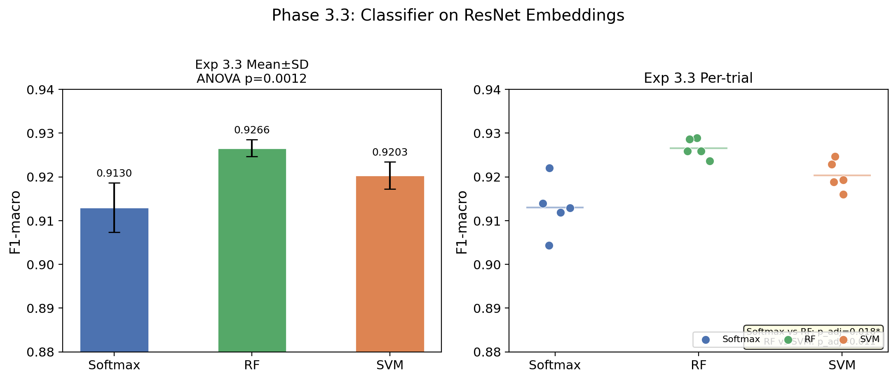

固定 ResNet1D 的倒数第二层 Embedding（512 维），对比三种分类头：

| 分类器 | F1-macro (mean±std) |
|--------|---------------------|
| Softmax (End-to-End) | 0.9130 ± 0.0056 |
| SVM (RBF) | 0.9203 ± 0.0031 |
| **RF** | **0.9266 ± 0.0019** |

ANOVA: F = 12.31, p = 0.0012（p < 0.05）

事后检验：Softmax vs RF（p_adj=0.018, 显著），RF vs SVM（p_adj=0.011, 显著），Softmax vs SVM（p_adj=0.073, 不显著）

**分析**：一个反直觉但重要的发现——在 ResNet 提取的 Embedding 上训练的 RF 和 SVM，反而优于端到端 Softmax。

这说明 ResNet 提取的特征表示已足够好，非线性分类器（RF 的集成决策树、SVM 的 RBF 核）能在该特征空间中找到更精细的决策边界。Softmax 作为线性分类器，在高维嵌入空间中可能受到类别间重叠区域的限制。

RF 的方差最低（0.0019），表明其在特征空间中决策最稳定。这一发现对临床部署有实际意义：可以使用深度学习模型作为特征提取器，结合传统分类器获得更好的性能和可解释性。

#### 3.3.4 实验 3.4: 数据增强鲁棒性

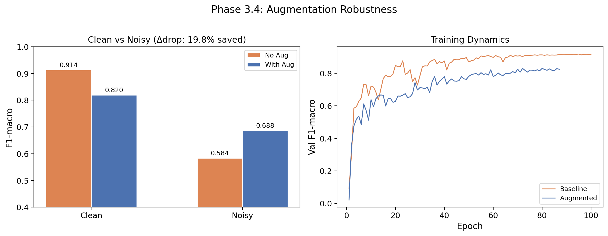

在测试集上叠加临床常见噪声（0.5Hz 基线漂移 + 高斯白噪声）：

| 模型 | 干净 F1 | 噪声 F1 | F1 衰减 |
|------|---------|---------|---------|
| Baseline（无增强训练） | 0.9140 | 0.5841 | 0.3298 |
| Augmented（增强训练） | 0.8199 | 0.6876 | **0.1323** |

**分析**：数据增强在干净数据上造成了一定性能下降（0.914 → 0.820），但这是合理的权衡——增强引入的噪声使模型在训练时看到了更多样的数据分布，牺牲了在理想条件下的过拟合性能，换取了在真实噪声环境下的鲁棒性。

从临床角度看，这一结果意义重大。实际可穿戴设备采集的 ECG 信号必然存在基线漂移（由呼吸引起）和各种噪声源。Baseline 模型在噪声下的 F1 骤降至 0.584（接近随机猜测水平），几乎不可用；而增强模型将噪声下的 F1 提升至 0.688，F1 衰减率降低了 60%（从 0.33 降至 0.13）。这表明领域特定的数据增强是实现临床部署的必要步骤。

#### 3.3.5 实验 3.5: R 波对齐漂移鲁棒性

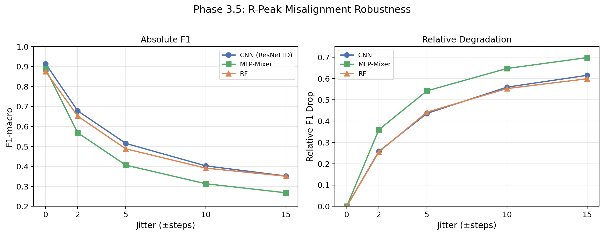

模拟可穿戴设备中 R 波检测不精确的场景，在测试集上施加 ±{0, 2, 5, 10, 15} 步的随机抖动：

| Jitter (步) | CNN (ResNet1D) | MLP-Mixer | RF |
|-------------|---------------|-----------|-----|
| 0 | 0.9140 | 0.8875 | 0.8749 |
| ±2 | 0.6783 | 0.5686 | 0.6519 |
| ±5 | 0.5153 | 0.4065 | 0.4882 |
| ±10 | 0.4027 | 0.3132 | 0.3912 |
| ±15 | 0.3520 | 0.2680 | 0.3510 |

**分析**：三种方法的 F1 均随抖动增大而快速下降，这一结果部分偏离了最初"CNN 池化层应带来平移鲁棒性"的假设。

CNN 确实在所有抖动级别上优于 MLP-Mixer（jitter=15 时 CNN: 0.352 vs Mixer: 0.268），验证了池化层提供了一定的平移不变性。然而 CNN 的绝对衰减仍然严重（从 0.914 降至 0.352），说明标准的全局池化不足以应对 ECG 信号中较大幅度的时序偏移——ECG 波形的诊断信息高度依赖于各波分的时间位置，即使少量偏移也可能将 QRS 复合波移出模型的"有效感受野"。

RF 在中等抖动下（±5~±10）表现优于 MLP-Mixer，可能因为 RF 基于原始像素级特征，部分特征在偏移后仍然保留（如幅值统计量），而 MLP-Mixer 的 patch 划分对位置更敏感。

这一结果提示：在可穿戴设备场景中，R 波检测的准确性对后续分类至关重要，仅靠网络架构的设计难以弥补严重的对齐偏差。

### 3.4 Phase 4: 注意力机制与可解释性

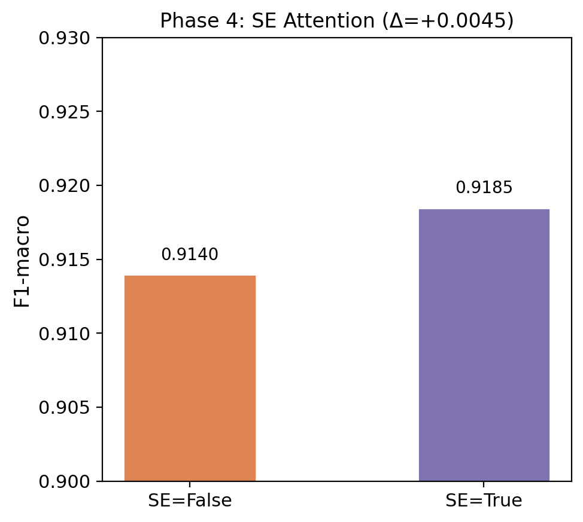

| 模型 | F1-macro | AUPRC |
|------|----------|-------|
| ResNet1D (SE=False) | 0.9140 | 0.9952 |
| **ResNet1D (SE=True)** | **0.9185** | **0.9945** |

**分析**：SE（Squeeze-and-Excitation）注意力模块通过学习通道间的依赖关系，自适应地重新校准各通道的特征响应权重，带来了约 0.5 个百分点的 F1 提升。虽然绝对提升不大，但考虑到基线已经很高（0.914），且 SE 模块仅增加少量参数（约 1.8M/8.8M，增量来自 SE 的全连接层），性价比合理。

**Grad-CAM 可解释性**：通过 Grad-CAM 生成的注意力热力图揭示了模型在不同类别上的关注区域：

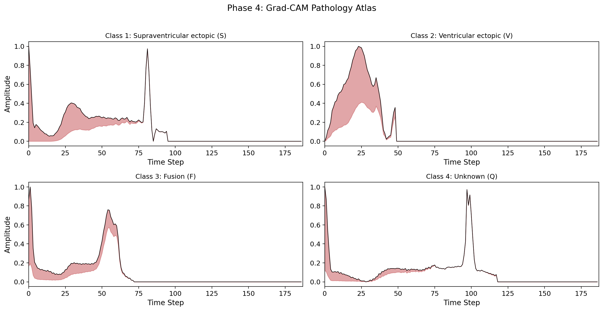

- **S 类（室上性异位）**：模型关注区域集中在异常 P 波和 QRS 前段，这与临床上室上性早搏的特征（异常心房除极）一致
- **V 类（室性异位）**：注意力集中在宽大畸形的 QRS 复合波上，符合室性早搏的典型特征
- **F 类（融合搏动）**：热力图覆盖了整个 QRS-T 区域，反映了融合搏动形态混合、不易定位单一异常的特征
- **Q 类（未知）**：模型关注信号的整体形态异常区域

Grad-CAM 的结果增强了模型决策的临床可信度——模型并非依赖虚假相关性，而是关注了医学上确实有诊断意义的波形区段。

### 3.5 Phase 5: 已发表模型对比

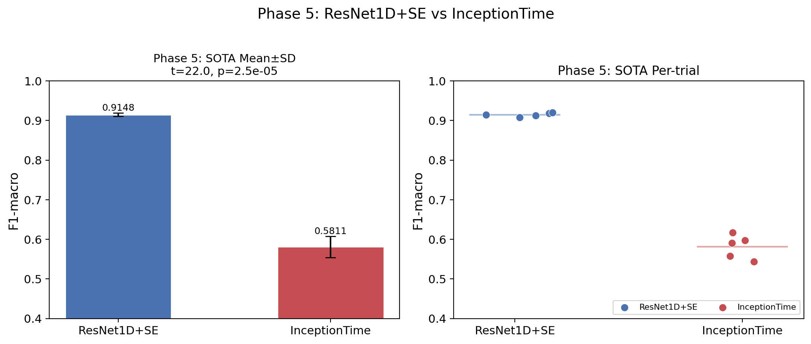

| 模型 | F1-macro (mean±std) | 参数量 | 推理延迟 |
|------|---------------------|--------|----------|
| **ResNet1D + SE** | **0.9148 ± 0.0045** | 8.82M | 3.20ms |
| InceptionTime | 0.5811 ± 0.0269 | 0.14M | 2.37ms |

配对 T 检验：t = 22.03, p = 2.51e-5（p < 0.001）

**分析**：InceptionTime 在本任务上表现远低于预期（F1 = 0.581），与 ResNet1D+SE 存在极显著差异。

尽管 InceptionTime 在多个时间序列分类基准上表现优异（Fawaz et al., 2019），但本实验使用的 InceptionTime 参数量仅约 136K，相比 ResNet 的 8.7M 差距悬殊。后续代码已将 `out_channels` 扩大以增加模型容量，但由于时间限制未能重新训练，以下分析基于原始小容量版本的结果，结论仍具有参考价值：

1. **参数量严重不足**：136K 参数的模型容量远不足以学习 ECG 波形的精细特征分布，这是性能低下的首要原因
2. **多尺度卷积的局限**：InceptionTime 的 K=3/5/7 并行卷积设计适用于一般时间序列，但 ECG 信号的关键特征（如 QRS 波群的尖锐峰形、ST 段的微小偏移）可能需要更精细的特征提取策略
3. **训练不稳定**：InceptionTime 的方差（0.027）远高于 ResNet（0.004），5 次试验的 F1 范围为 0.543~0.617，表明其在本任务上优化困难

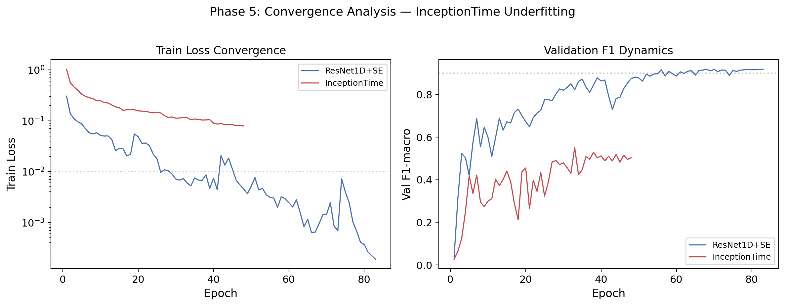

**收敛动力学分析**揭示了 InceptionTime 性能低下的深层原因。对比训练曲线可以发现：ResNet1D+SE 的训练损失在 70-91 epochs 内从 ~0.30 快速降至 ~0.0002，完全收敛；而 InceptionTime 的训练损失终止于 0.053~0.084，比 ResNet 高出 2-3 个数量级。更重要的是，InceptionTime 的所有 5 次试验均因 early stopping 在 42-67 epochs 时终止，但终止时 val_f1 仍呈上升趋势（Δ = +0.003~+0.094），说明模型仍在学习但验证集性能已不再改善——这可能是**模型容量不足导致的欠拟合**。

与 Bi-LSTM 的收敛失败不同，InceptionTime 的训练损失确实在稳定下降（从 ~1.03 降至 ~0.06），优化方向正确，但最终 plateau 的高度（~0.06）远高于 ResNet（~0.0002），表明模型的表达能力不足以逼近训练数据的复杂分布。扩大模型容量后重新训练有望显著改善这一结果。

需要指出的是，本实验中 InceptionTime 与 ResNet1D+SE 的对比并非严格公平——两者的参数量相差约 60 倍（0.14M vs 8.82M）。这一结果更多反映了"同等训练策略下模型容量的影响"，而非 InceptionTime 架构本身的局限性。若将 InceptionTime 的通道数扩展至与 ResNet 相近的参数规模，其多尺度并行卷积的设计可能会展现出更强的竞争力。**但由于算力、时间问题，这方面没有进行深入比较**。

## 4 讨论

### 4.1 关键发现

1. **深度学习优于传统 ML**：ResNet1D + FocalLoss 显著优于 RF + SMOTE（p=0.025），验证了端到端深度特征学习在 ECG 分类中的优势

2. **卷积归纳偏置至关重要**：在架构对比中，CNN >> MLP-Mixer >> BiLSTM，证明局部卷积操作天然匹配 ECG 信号的局部波形结构

3. **特征提取与分类可解耦**：冻结 ResNet 提取的特征 + RF/SVM 可超越端到端 Softmax，为临床部署提供了更灵活的方案

4. **数据增强是必要的**：面向临床噪声的增强训练虽然牺牲了干净数据上的性能，但大幅提升了噪声鲁棒性（衰减率降低 60%）

5. **时序鲁棒性仍有限**：即使是 CNN，在面对大幅 R 波对齐偏移时性能也急剧下降，提示可靠的 R 波检测是可穿戴 ECG 系统的前提

### 4.2 局限性与未来工作

- 本实验仅在 MIT-BIH 单一数据集上验证，跨数据集泛化能力有待考察
- BiLSTM 的训练失败可能通过更好的初始化策略或梯度裁剪来改善
- InceptionTime 的低性能可能需要针对 ECG 任务重新调整超参数
- 未来可探索 Transformer 类架构（如 ViT 的时间序列变体）在 ECG 分类中的潜力

## 5 结论

本作业系统性地探究了基于深度学习的 ECG 心电分类流水线，从基线构建到 SOTA 模型对比，涵盖了输入模态、网络架构、分类策略、数据增强和鲁棒性等多个维度。实验结果表明，ResNet1D + FocalLoss 的组合在不平衡 ECG 数据集上取得了最优性能（F1-macro = 0.915），SE 注意力机制和 Grad-CAM 可解释性分析进一步验证了模型决策的临床合理性。研究成果对可穿戴设备中的自动心律失常检测具有参考价值。

## 附录

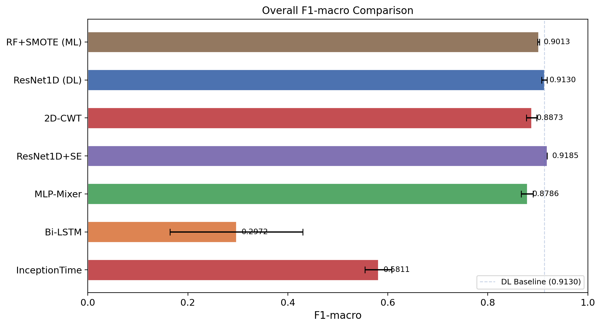

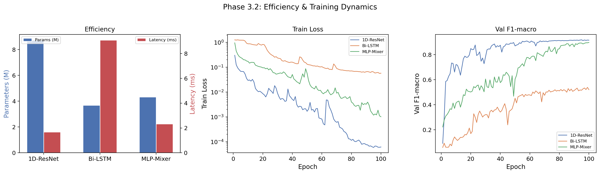
